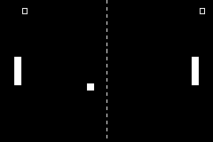

# PONG GBA

Classic Pong implementation for the Game Boy Advance, written in C with devkitARM.



## About

A from-scratch single-player Pong for the original GBA hardware. The player controls the left paddle against a predictive AI opponent. First to reach 11 points wins.

Built as a learning project for bare-metal GBA development.

## Controls

|    Input    |             Action             |
|-------------|--------------------------------|
| D-pad ↑ / ↓ | Move left paddle               |
| A           | Restart after win/game-over    |

## Build

Requires [devkitARM](https://devkitpro.org/). After installation:

```bash
make
```

Produces `pong_gba.gba`, which can be run on any GBA emulator (e.g. mGBA) or flashed to a cartridge.

## Implementation notes

- **Bare-metal C, no game engine.** All hardware registers, VRAM, OAM, and tilemaps are managed directly.
- **Sprite rendering** uses an OAM double-buffer pattern: writes go to a RAM buffer during the frame, then `memcpy`'d to OAM in a single transfer during VBlank.
- **Background** uses Mode 0 with BG0 in regular 32×32 tile mode for the court and score display.
- **AI opponent** is predictive: it extrapolates the ball trajectory to determine impact y, with intentional imprecision to make it beatable.
- **Ball physics**: accelerates every four paddle hits up to a capped speed, with bounce angle determined by the contact point on the paddle.
- **Score** is rendered as background tiles, updated in place when points are scored.

## Limitations

- No audio: sound is out of scope this release and is planned for a future project.

## Project structure

```
source/
├── main.c        - Game loop and hardware setup
├── game.c        - Game logic (ball, paddles, scoring, AI)
└── graphics.c    - Sprite rendering

include/
├── registers.h   - GBA hardware register definitions
├── game.h        - Game state and function prototypes
├── graphics.h    - Rendering function prototypes
└── all_gfx.h     - Auto-generated, master header for graphics assets

graphics/         - PNG sources and grit conversion configs
```

## Credits

Author: Ernesto De Felice ([@edefelice](https://github.com/edefelice))